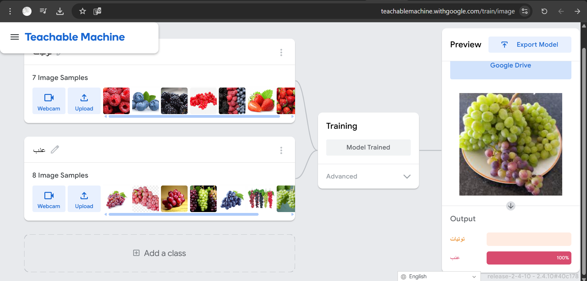
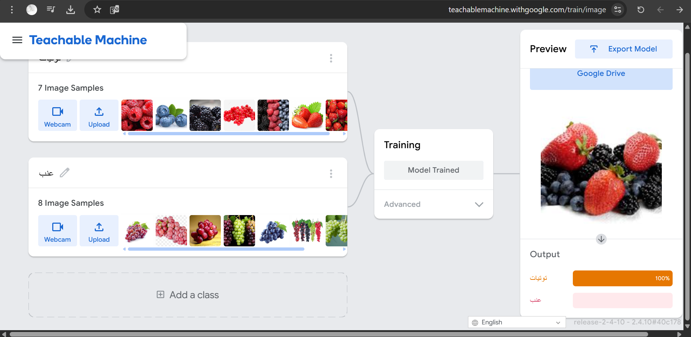
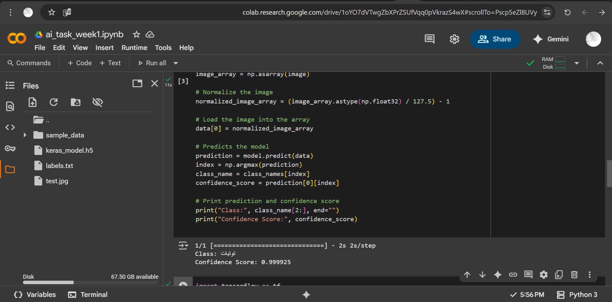
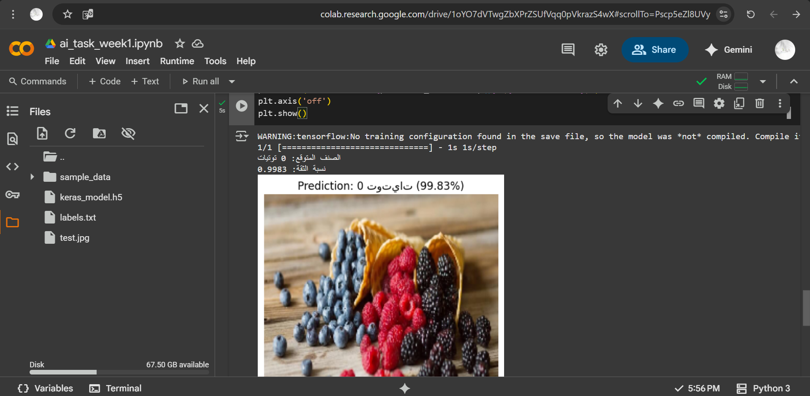

# 🧠 Image Classification Project using Teachable Machine

## 👩‍💻 Developer:
*Abeer Alasmri*  
*Track:* Artificial Intelligence and Robot Operating Systems (ROS)

---

## 🛠️ Tools & Technologies Used:
- [Teachable Machine by Google](https://teachablemachine.withgoogle.com/)
- Google Colab

---

## 💡 Project Idea:
This project involves building an intelligent model capable of classifying types of fruits based on images. The model was trained using Google's Teachable Machine and tested using Python code in Google Colab.

---

## 🎯 Project Objectives:
- Train an image classification model with two categories
- Export the trained model in Keras format
- Use Python to load and test the model with images
- Upload and document the project on GitHub

---

## 📝 Task Description:
- The model was trained to classify two fruit groups:
  - *Class 1:* Berries and strawberries (e.g., red berries, blueberries, blackberries, strawberries)
  - *Class 2:* Grapes (various colors)
- After training, the model was exported and tested using two scripts:
  1. The default script from Teachable Machine
  2. A custom script that also displays the image with prediction

---

## 📁 Included Files:

| File | Description |
|------|-------------|
| keras_model.h5 | The trained model (Keras format) |
| labels.txt | The label names for each class |
| test.jpg | Test image used for prediction |
| tm_script.py | Teachable Machine's default script |
| custom_code.py | Custom script with image visualization |
| ai_task_week1.ipynb | Google Colab notebook containing both scripts |
| screenshot_tm.png | Screenshot of output from the default script |
| screenshot_custom.png | Screenshot of output from the custom script |
| training_step1.png | Screenshot of Prediction result for a grapes image (100%) |
| training_step2.png | Screenshot of Prediction result for a berries image (100%) |

---

## 🧪 Model Training – Teachable Machine

The model was trained using Teachable Machine by uploading various fruit images and organizing them into two classes:

- *Class 1:* Berries (red berries, blueberries, blackberries, strawberries)
- *Class 2:* Grapes (green, red, black)

Below are some screenshots taken during the model training process:

  

  

---

## ▶️ How to Run:

1. Open the notebook file [ai_task_week1.ipynb](https://colab.research.google.com/github/Abeer-Alasmri/ai-task-week1/blob/main/ai_task_week1.ipynb) in Google Colab.
2. In the left panel in Colab, click on the *Files* tab, then click *Upload* and upload the following files:
   - keras_model.h5
   - labels.txt
   - test.jpg
3. After uploading the files, run the notebook cells one by one.
4. The prediction result will appear in the output:
   - You will see the predicted class (e.g., Berries or Grapes)
   - The confidence score of the prediction
   - If using the custom script, the image will also be displayed with the result

> ⚠️ *Note:* The model and image files must be uploaded manually in the Colab session each time you open the notebook. Otherwise, the code will return a "FileNotFoundError".

---

## 📸 Screenshots of Code Output:

*From the default script:*

*From the custom script:*

---

## 🔗 Google Colab Link:
[Open this project in Google Colab](https://colab.research.google.com/github/Abeer-Alasmri/ai-task-week1/blob/main/ai_task_week1.ipynb)

---

## 📝 Notes:
- The model is simple and binary-class
- All code files and images are included in this repository
